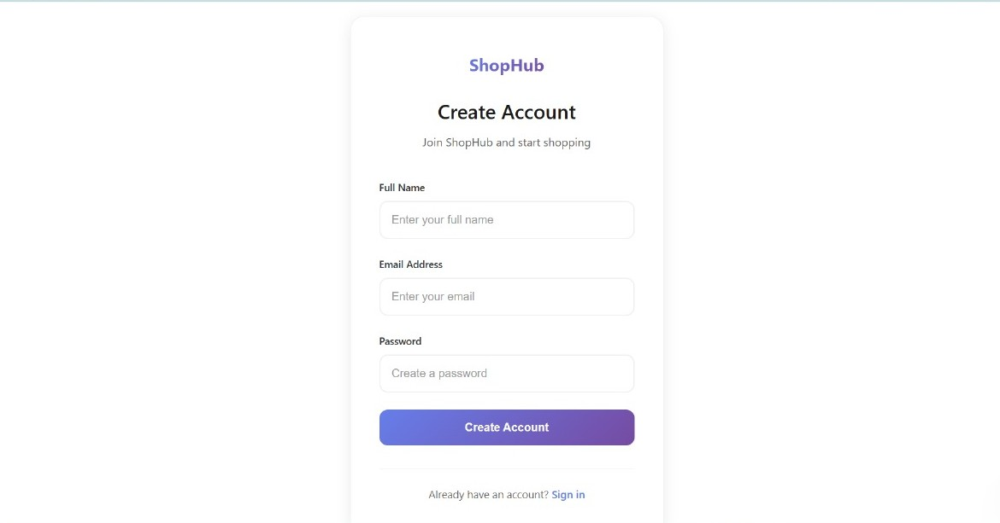
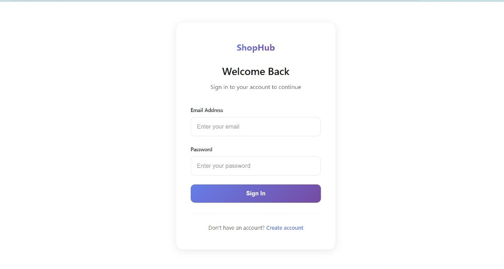
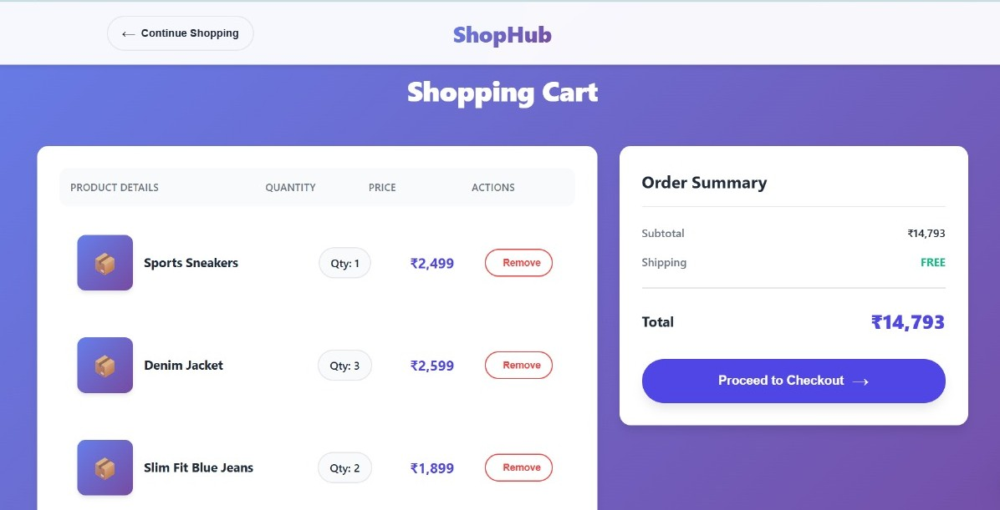
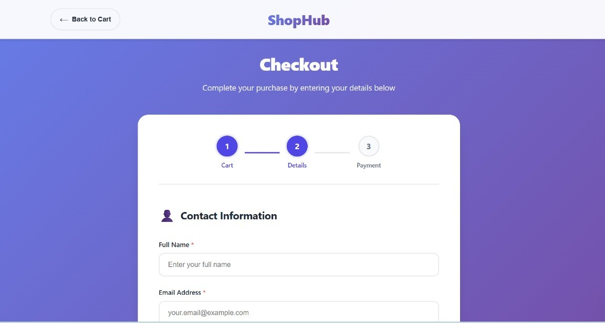
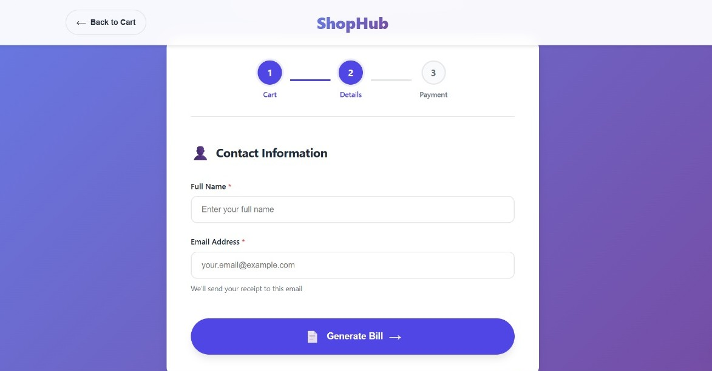
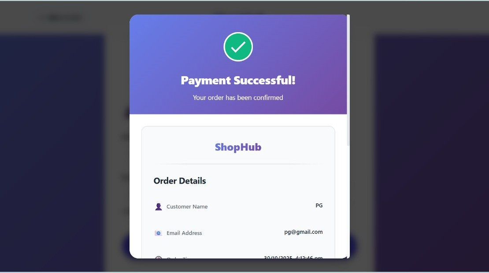
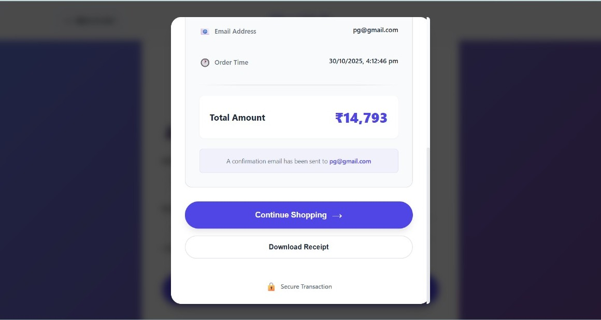

# 🛒 Vibe Commerce Backend

A simple **Node.js + Express + MongoDB** backend for an e-commerce demo app.  
Supports basic product listing, cart management, and checkout functionalities.

---

## 🚀 Features

- User Authentication (JWT-based)
- Product listing (mock data)
- Add / Remove items from cart
- Checkout with user validation (name & email check)
- MongoDB integration with Mongoose
- Modular API routes

---

## 🧩 Tech Stack

- **Backend:** Node.js, Express.js  
- **Database:** MongoDB with Mongoose  
- **Auth:** JWT (JSON Web Token)  
- **Environment:** dotenv for secrets  
- **Testing:** Postman / Thunder Client  

---

## ⚙️ Setup Instructions

### 1️⃣ Clone Repository
```bash
git clone https://github.com/yourusername/vibe-commerce-backend.git
cd vibe-commerce-backend
```
2️⃣ Install Dependencies
```bash

npm install
```

3️⃣ Create .env File
Create a .env file in the root directory with the following values:


```env

PORT=5000
MONGO_URI=mongodb+srv://your_mongodb_connection_string
JWT_SECRET=your_jwt_secret
```
4️⃣ Run the Server
```bash
npm start
```
or for auto-reload:

```bash
npm run dev
```
Server runs on:

👉 http://localhost:5000


📦 API Endpoints

🧱 Products

GET /api/products

Description: Fetch all available mock products.
Response:

```json

[
  {
    "_id": "p1",
    "name": "Wireless Headphones",
    "price": 1499
  },
  {
    "_id": "p2",
    "name": "Smartwatch",
    "price": 2499
  }
]
```
🛍️ Cart

POST /api/cart

Description: Add an item to the user's cart.

Request Body:

```json
{
  "productId": "p1",
  "qty": 2
}
```
Response:

```json
{
  "message": "Item added to cart successfully",
  "cartItem": {
    "_id": "6510...",
    "productId": "p1",
    "qty": 2
  }
}
```
GET /api/cart

Description: Get all items in the logged-in user's cart and total price.

Response:
```json

{
  "items": [
    {
      "id": "6510...",
      "name": "Wireless Headphones",
      "price": 1499,
      "qty": 2
    }
  ],
  "total": 2998
}
```
DELETE /api/cart/:id

Description: Remove an item from the cart by ID.

Example:

DELETE /api/cart/6510f1b3c8d9a6f1c1234567

Response:
```json

{
  "message": "Item removed from cart"
}
```
💳 Checkout

POST /api/checkout

Protected Route: Requires JWT token in headers

Description: Checkout the cart, generate a mock receipt.

Request Header:

```makefile

Authorization: Bearer <token>
```
Request Body:

```json

{
  "name": "John Doe",
  "email": "john@example.com"
}
```
Response:

```json

{
  "message": "Checkout successful",
  "receiptId": "671b5e0...",
  "total": 2998,
  "timestamp": "2025-10-29T18:25:43.511Z",
  "name": "John Doe",
  "email": "john@example.com"
}
```
🔐 Auth Flow

Register

POST /api/users/register

```json

{
  "name": "John Doe",
  "email": "john@example.com",
  "password": "123456"
}
```
Login

POST /api/users/login

```json

{
  "email": "john@example.com",
  "password": "123456"
}
```
Response:

```json
{
  "token": "<jwt_token>"
}
```
Use this token for protected routes like /api/cart and /api/checkout.

📁 Project Structure
```bash

project-root/
│
├── backend/
│   ├── middleware/
│   │   └── auth.js
│   │
│   ├── models/
│   │   ├── CartItem.js
│   │   ├── Product.js
│   │   ├── Receipt.js
│   │   └── User.js
│   │
│   ├── routes/
│   │   ├── cart.js
│   │   ├── checkout.js
│   │   ├── products.js
│   │   └── user.js
│   │
│   ├── node_modules/
│   │
│   ├── .env
│   ├── package.json
│   ├── package-lock.json
│   ├── seed.js
│   └── server.js
│
├── frontend/
│   ├── node_modules/
│   │
│   ├── public/
│   │   └── index.html
│   │
│   ├── src/
│   │   ├── components/
│   │   │   ├── CartPage.css
│   │   │   ├── CartPage.jsx
│   │   │   ├── CheckoutPage.css
│   │   │   ├── CheckoutPage.jsx
│   │   │   ├── LoginPage.jsx
│   │   │   ├── ProductList.css
│   │   │   ├── ProductList.jsx
│   │   │   ├── ReceiptModal.css
│   │   │   ├── ReceiptModal.jsx
│   │   │   ├── RegisterPage.jsx
│   │   │   └── styles.css
│   │   │
│   │   ├── context/
│   │   │   └── UserContext.js
│   │   │
│   │   ├── api.js
│   │   ├── App.js
│   │   └── index.js
│   │
│   ├── package.json
│   └── package-lock.json
│
└── README.md
```
🧠 Notes:

Ensure you’re logged in to access cart and checkout APIs.

Mock product data can be preloaded or hardcoded.

Cart and checkout APIs are user-specific (based on token).

🧑‍💻 Author:

Priti Giri

Full Stack Developer | IT Student at Techno Main Salt Lake

---

Register


Login


ProductList


ItemCart


CheckoutBill



PaymentReceipt




